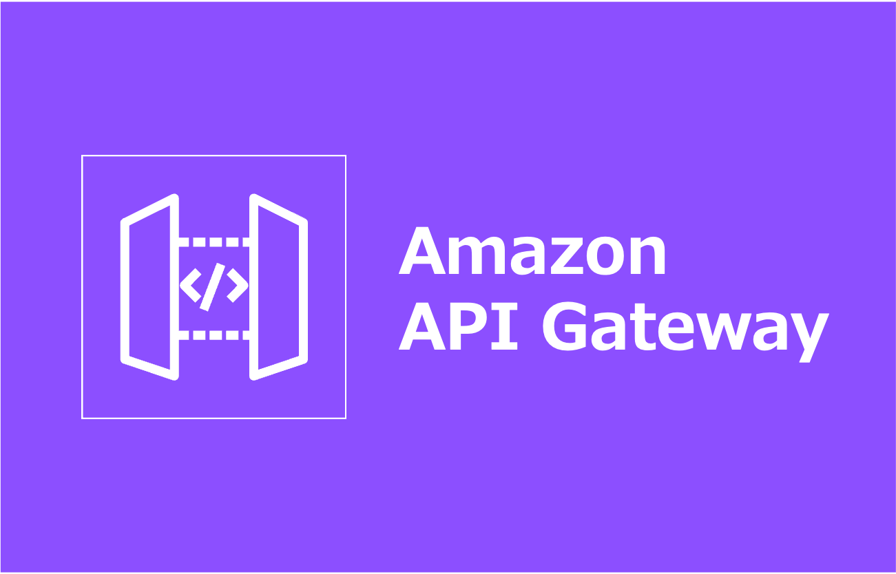
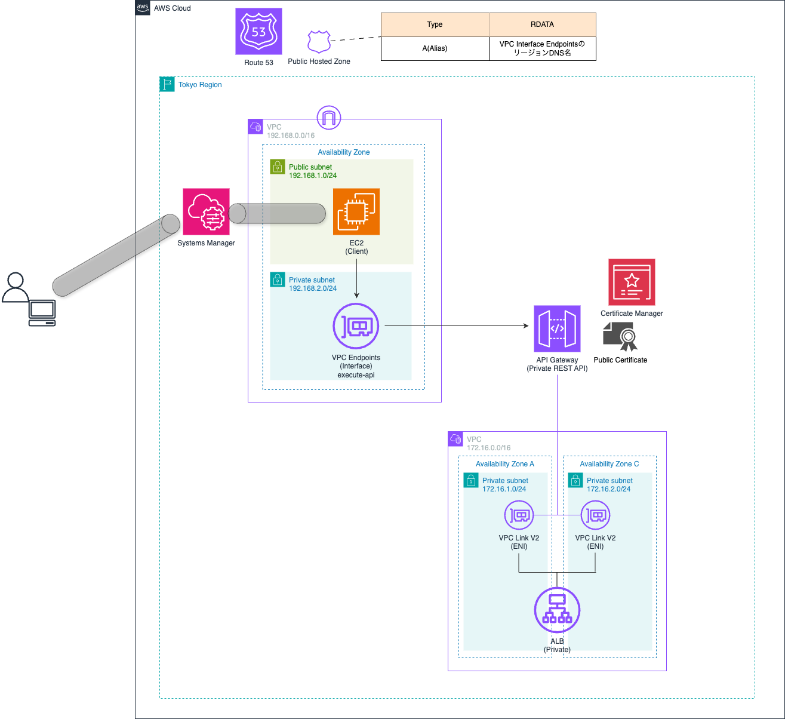

=====================================================================
API Gateway (Private REST API) をカスタムドメインで構築
=====================================================================

=====================================================================
構成図
=====================================================================

=====================================================================
デプロイ - CloudFormation -
=====================================================================

作業環境 - ローカル -
=====================================================================
* macOS Tahoe ( v26.2 )
* Visual Studio Code 1.108.2
* Rain v1.24.2
* aws-cli 2.33.12

フォルダ構成
=====================================================================
* `こちら <./folder.md>`_ を参照

前提条件
=====================================================================
* *AdministratorAccess* がアタッチされているIAMユーザーを作成していること
* 実作業は *envs* フォルダ配下の各環境フォルダで実施すること
* 以下コマンドを実行し、*admin* プロファイルを作成していること (デフォルトリージョンは *ap-northeast-1* )

.. code-block:: bash

  aws login --profile admin

事前作業(1)
=====================================================================
1. 各種モジュールインストール
---------------------------------------------------------------------
* `GitHub <https://github.com/tyskJ/common-environment-setup>`_ を参照

事前作業(2)
=====================================================================
1. デプロイ用バケット作成
---------------------------------------------------------------------
.. code-block:: bash

  aws s3 mb \
  s3://cfn-working \
  --profile admin 

.. note::

  * バケット名は、全世界で一意である必要があります
  * 作成に失敗した場合は、バケット名を修正してください

実作業 - ローカル -
=====================================================================
1. 変数ファイル作成
---------------------------------------------------------------------
.. code-block:: bash

  cat <<EOF > config/private-apigateway-parameter.yml
  Parameters:
    HostedZoneId: パブリックホストゾーンID
    Fqdn: APIGatwayカスタムドメイン名
    DeploymentTrigger: V1
    StageVersion: V1
  EOF

.. note::

  * `DeploymentTrigger` は以下のように追加していくこと
  * 追加する毎にデプロイされていく

.. code-block::

  DeploymentTrigger: V1,
    V2,
    V3

.. note::

  * `StageVersion` はステージに紐づけるデプロイのバージョンとすること

2. スタックデプロイ
---------------------------------------------------------------------
.. code-block:: bash

  rain deploy private-apigateway.yml PRIVATE-APIGATEWAY \
  --s3-bucket cfn-working \
  --config config/private-apigateway-parameter.yml \
  --profile admin -y

.. note::

  * S3バケット名は必要に応じて修正してください

動作確認
=====================================================================
* `詳細 <./envs/README.rst>`_

後片付け - ローカル -
=====================================================================
1. スタック削除
---------------------------------------------------------------------
.. code-block:: bash

  rain rm PRIVATE-APIGATEWAY --profile admin -y

.. note::

  * スタック削除後、*DNS検証* で自動作成されたAPI Gatway用証明書の *CNAMEレコード* は残る
  * そのため、不要なら手動で *CNAMEレコード* を削除すること

.. warning::

  * 初回削除時に、ACMの削除に失敗する場合があります
  * その際は、何度か削除コマンドを実行してください

2. デプロイ用バケット削除
---------------------------------------------------------------------
.. code-block:: bash

  aws s3 rm --recursive s3://cfn-working --profile admin
  aws s3 rb s3://cfn-working --profile admin

.. note::

  * S3バケット名は必要に応じて修正してください

参考資料
=====================================================================
リファレンス
---------------------------------------------------------------------
* `AWS リソースおよびプロパティタイプのリファレンス - Template Reference <https://docs.aws.amazon.com/ja_jp/AWSCloudFormation/latest/TemplateReference/aws-template-resource-type-ref.html>`_
* `API Gateway でのプライベート API のカスタムドメイン名 - デベロッパーガイド <https://docs.aws.amazon.com/ja_jp/apigateway/latest/developerguide/apigateway-private-custom-domains.html>`_

ブログ
---------------------------------------------------------------------
* `CDKでの aws_apigateway と aws_apigatewayv2 の違い - Zenn <https://zenn.dev/iret/articles/03af759a62f855>`_
* `API GatewayをCloudFormationで構築したら、マネコンとの項目の関連がわからなすぎたので、二度と調べなくていいようにまとめました - DevelopersIO <https://dev.classmethod.jp/articles/put-together-about-the-relationship-between-cfn-and-management-console-items/>`_
* `[アップデート] REST APIのAPI Gatewayのプライベート統合でALBを直接指定できるようになりました <https://dev.classmethod.jp/articles/api-gateway-rest-apis-integration-load-balancer/>`_
* `Amazon API Gateway のプライベート REST API でカスタムドメインが使えるようになっていたので設定してみた - DevelopersIO <https://dev.classmethod.jp/articles/api-gateway-custom-domain-name-private-rest/>`_
* `Amazon API Gateway は何をしてるのか - DevelopersIO <https://dev.classmethod.jp/articles/what-does-amazon-api-gateway-do/>`_
